# Self-Healing Kubernetes Monitoring Platform

A cloud-native monitoring and self-healing platform built on AWS and Kubernetes. The project combines infrastructure-as-code, containerization, CI/CD, Kubernetes orchestration, Prometheus/Grafana monitoring, and automated workload recovery.

---

## 📌 Overview

This project demonstrates a self-healing application platform where a containerized FastAPI application is deployed on a Kubernetes cluster running on AWS.

The platform continuously monitors application and Kubernetes metrics using Prometheus and Grafana. When an application pod is intentionally terminated, Kubernetes detects the difference between the desired and actual state and automatically creates a replacement pod.

The project also includes infrastructure provisioning through Terraform and a Jenkins-based CI/CD workflow for building and publishing the application container.

---

## 🏗️ Architecture

```text
                         ┌─────────────────────┐
                         │       GitHub        │
                         │   Source Repository │
                         └──────────┬──────────┘
                                    │
                                    ▼
                         ┌─────────────────────┐
                         │       Jenkins       │
                         │      CI Pipeline     │
                         └──────────┬──────────┘
                                    │
                                    ▼
                         ┌─────────────────────┐
                         │       Docker        │
                         │   Container Build   │
                         └──────────┬──────────┘
                                    │
                                    ▼
                         ┌─────────────────────┐
                         │     Amazon ECR      │
                         │   Container Image   │
                         └──────────┬──────────┘
                                    │
                                    ▼
              ┌────────────────────────────────────────┐
              │              AWS EC2 / K3s              │
              │                                        │
              │   ┌────────────────────────────────┐   │
              │   │          Kubernetes            │   │
              │   │                                │   │
              │   │  ┌──────────┐  ┌──────────┐   │   │
              │   │  │ FastAPI  │  │ FastAPI  │   │   │
              │   │  │   Pod    │  │   Pod    │   │   │
              │   │  └──────────┘  └──────────┘   │   │
              │   │                                │   │
              │   │  ┌────────────────────────┐   │   │
              │   │  │ Remediation Service     │   │   │
              │   │  └────────────────────────┘   │   │
              │   └────────────────────────────────┘   │
              │                                        │
              │   ┌──────────────┐  ┌──────────────┐  │
              │   │  Prometheus  │  │   Grafana    │  │
              │   └──────────────┘  └──────────────┘  │
              └────────────────────────────────────────┘

```
---

## 🛠️ Technology Stack

### ☁️ Cloud

- AWS EC2
- Amazon ECR
- AWS IAM
- AWS VPC
- AWS Security Groups

### 🏗️ Infrastructure as Code

- Terraform

### 🐳 Containerization

- Docker

### 🔄 CI/CD

- Jenkins
- GitHub

### ☸️ Kubernetes

- K3s
- Kubernetes
- Kubernetes Deployments
- Kubernetes Services

### 📊 Monitoring

- Prometheus
- Grafana
- Kubernetes Metrics
- Application Metrics

### 🐍 Application

- Python
- FastAPI
- Uvicorn

### 🖥️ Operating System

- Ubuntu
- Linux
- Bash

## 📁 Project Structure

```text
self-healing-kubernetes-platform/
│
├── app/
│   └── main.py
│
├── docs/
│   └── screenshots/
│       │
│       ├── 01-monitoring-dashboard/
│       │   ├── 01-service-health.png
│       │   ├── 02-request-metrics.png
│       │   ├── 03-pod-metrics.png
│       │   ├── 04-deployment-metrics.png
│       │   └── 05-cluster-status.png
│       │
│       ├── 02-failure-and-detection/
│       │   ├── 01-service-health.png
│       │   ├── 02-request-metrics.png
│       │   ├── 03-pod-metrics.png
│       │   ├── 04-deployment-metrics.png
│       │   └── 05-cluster-status.png
│       │
│       └── 03-recovery-and-verification/
│           ├── 01-service-health.png
│           ├── 02-request-metrics.png
│           ├── 03-pod-metrics.png
│           ├── 04-deployment-metrics.png
│           └── 05-cluster-status.png
│
├── terraform/
│   ├── ec2.tf
│   ├── ecr.tf
│   ├── iam.tf
│   ├── networking.tf
│   ├── outputs.tf
│   ├── provider.tf
│   ├── security_groups.tf
│   ├── versions.tf
│   ├── vpc.tf
│   └── .terraform.lock.hcl
│
├── .gitignore
├── Dockerfile
├── Jenkinsfile
└── requirements.txt
```

## ☁️ AWS Infrastructure

The AWS infrastructure is provisioned using Terraform.

The infrastructure includes:

- Amazon VPC
- VPC networking
- EC2 instances
- Security Groups
- IAM roles and policies
- Amazon ECR
- Required networking components

Terraform provides a repeatable and version-controlled approach for provisioning the cloud infrastructure.

## 🏗️ Infrastructure as Code

The infrastructure is managed using Terraform.

### Initialize Terraform

```bash
terraform init
```

### Validate the Configuration

```bash
terraform validate
```

### Review the Infrastructure Changes

```bash
terraform plan
```

### Provision the Infrastructure

```bash
terraform apply
```

### Destroy the Infrastructure

When the infrastructure is no longer required:

```bash
terraform destroy
```

## 🐳 Docker

The FastAPI application is containerized using Docker.

### Build the Docker Image

```bash
docker build -t self-healing-app .
```

### Run the Container

```bash
docker run -p 8000:8000 self-healing-app
```

The Docker image is published to Amazon ECR and used by the Kubernetes deployment.

## 🔄 CI/CD Pipeline

Jenkins is used to automate the application build and container image publishing workflow.

The CI/CD process follows this flow:

```text
GitHub
   │
   ▼
Jenkins
   │
   ▼
Build Docker Image
   │
   ▼
Amazon ECR
   │
   ▼
Kubernetes
```

### Pipeline Workflow

1. Source code is maintained in GitHub.
2. Jenkins retrieves the project source code.
3. Jenkins builds the Docker image.
4. The Docker image is pushed to Amazon ECR.
5. The container image is then used by the Kubernetes deployment.

This provides an automated workflow for building and publishing application container images.

## ☸️ Kubernetes Deployment

The application runs on a K3s Kubernetes cluster hosted on AWS EC2.

The FastAPI application is deployed using Kubernetes Deployments with multiple replicas.

```text
              FastAPI Deployment
                     │
            ┌────────┴────────┐
            ▼                 ▼
       FastAPI Pod       FastAPI Pod
```

Kubernetes continuously maintains the desired number of application replicas.

### Check Application Pods

```bash
kubectl get pods -n self-healing
```

### Check Deployments

```bash
kubectl get deployments -n self-healing
```

### Check Services

```bash
kubectl get svc -n self-healing
```

### Check Kubernetes Nodes

```bash
kubectl get nodes
```

## 📊 Monitoring with Prometheus & Grafana

Prometheus is used to collect application and Kubernetes metrics, while Grafana provides a dashboard for visualizing the collected data.

The monitoring dashboard includes panels for:

- FastAPI Service Health
- Self-Healing Alert
- Application Errors
- Error Rate
- Request Rate
- Average Request Latency
- Total Application Requests
- Pod CPU Usage
- Pod Memory Usage
- Pod Availability
- Pod Restarts
- Kubernetes Pod Status
- Deployment Replicas
- Deployment Availability
- Kubernetes Node Status

### Monitoring Stack

```text
Application
     │
     ▼
Kubernetes
     │
     ▼
Prometheus
     │
     ▼
Grafana
     │
     ▼
Monitoring Dashboard
```

## 🚨 Failure Simulation & Detection

The self-healing behavior was tested by intentionally deleting a running FastAPI pod.

### Simulate Pod Failure

First, view the running application pods:

```bash
kubectl get pods -n self-healing
```

Delete one of the running FastAPI pods:

```bash
kubectl delete pod <pod-name> -n self-healing
```

For example:

```bash
kubectl delete pod fastapi-app-xxxxx -n self-healing
```

### Monitor the Pod Lifecycle

Watch the pods while Kubernetes replaces the deleted pod:

```bash
kubectl get pods -n self-healing -w
```

The replacement pod can be observed progressing through states such as:

```text
Running
   ↓
Terminating
   ↓
Replacement Pod Created
   ↓
Pending
   ↓
ContainerCreating
   ↓
Running
```

Kubernetes detects that the actual number of running replicas no longer matches the desired state defined by the Deployment and creates a replacement pod.

The monitoring dashboard captures the changes in application, pod, and deployment metrics during this process.

## 🔄 Self-Healing & Recovery

After the FastAPI pod was deleted, Kubernetes automatically created a replacement pod to maintain the desired replica count.

The recovery process was observed using:

```bash
kubectl get pods -n self-healing -w
```

The pod lifecycle showed the replacement pod moving through:

```text
Pending
   ↓
ContainerCreating
   ↓
Running
```

Once the replacement pod became ready, the Kubernetes Deployment returned to its desired state.

### Verify Recovery

Check the application pods:

```bash
kubectl get pods -n self-healing
```

Check the Deployment:

```bash
kubectl get deployment -n self-healing
```

Check the running replicas:

```bash
kubectl get pods -n self-healing -o wide
```

The Grafana dashboard can then be used to verify the application and Kubernetes metrics after recovery.

## 🖼️ Monitoring Dashboard Screenshots

The project includes screenshots documenting the monitoring dashboard across three stages:

### 1. Normal Operation

Shows the application and Kubernetes metrics while the system is operating normally.


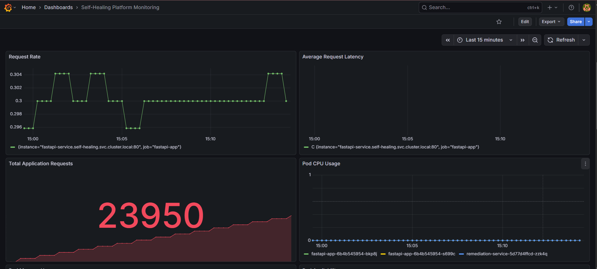

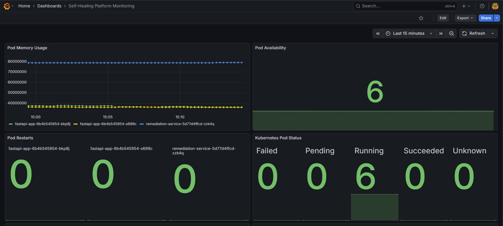

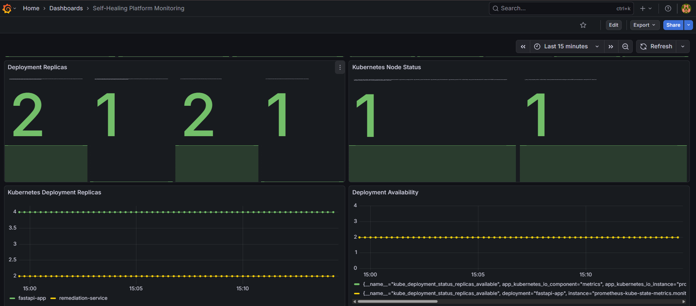

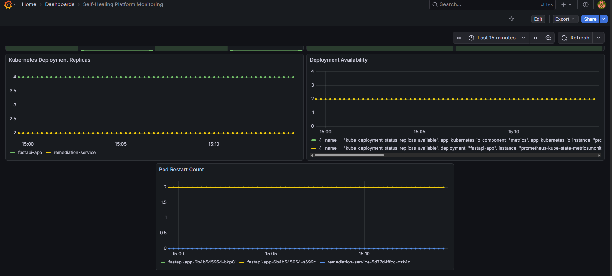

### 2. Failure & Detection

Shows the monitoring state during the intentional pod failure.

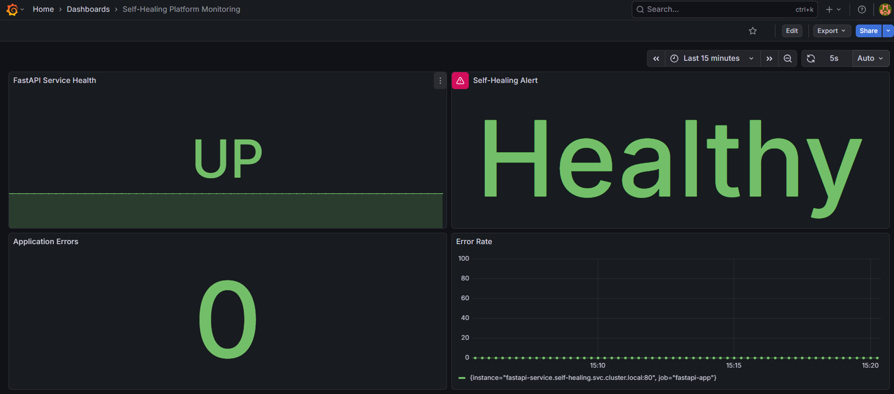

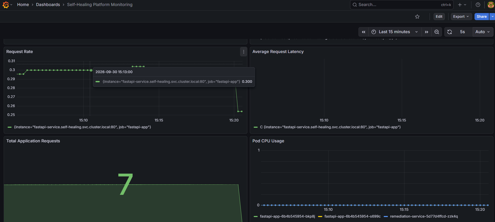

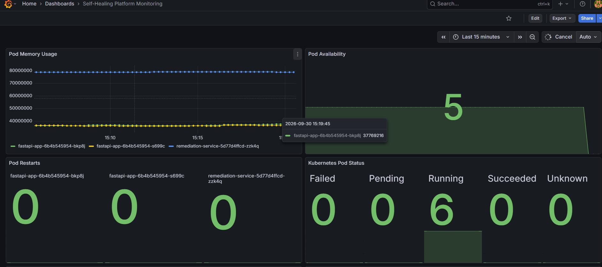

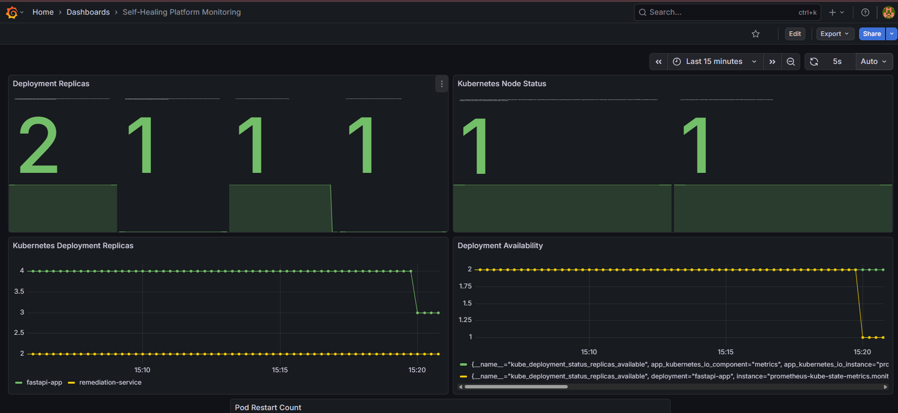

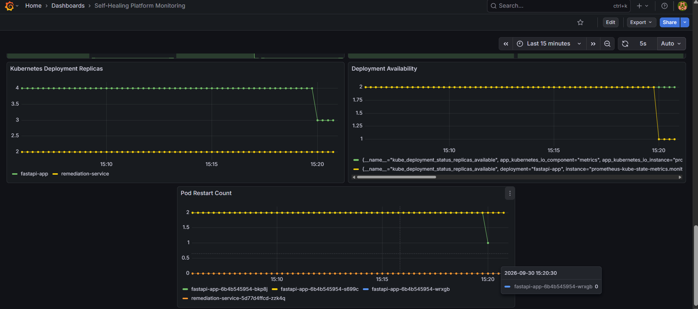

### 3. Recovery & Verification

Shows the system after Kubernetes creates the replacement pod and the workload returns to the desired state.

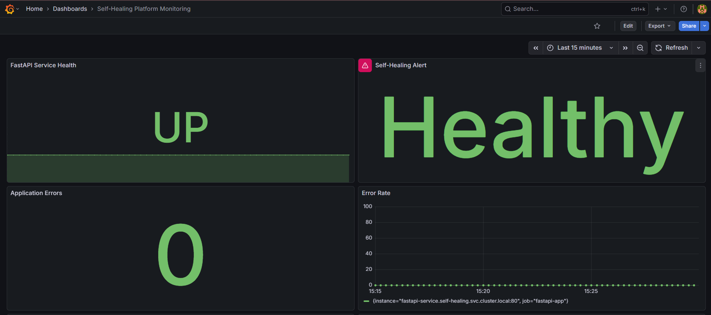

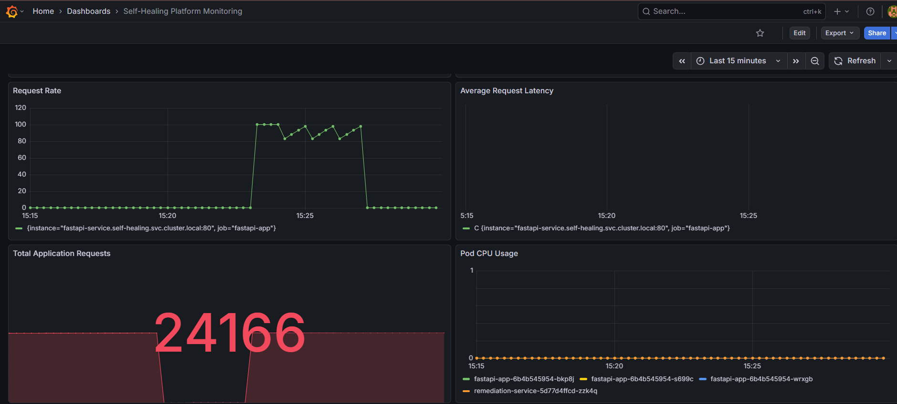

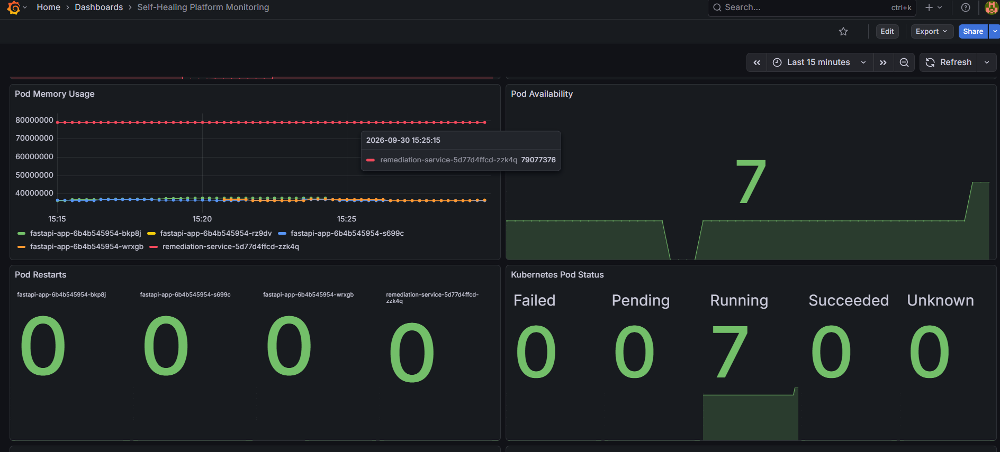

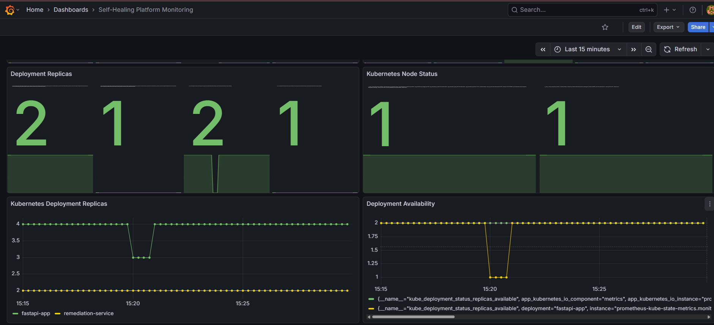

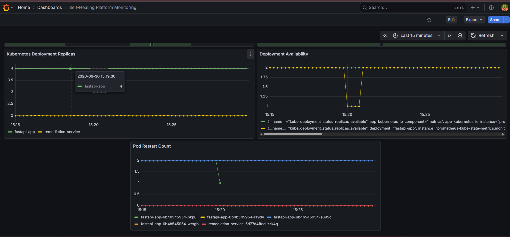

## 🔍 Useful Kubernetes Commands

### View All Pods

```bash
kubectl get pods -A
```

### View Application Pods

```bash
kubectl get pods -n self-healing
```

### View Monitoring Components

```bash
kubectl get pods -n monitoring
```

### View Deployments

```bash
kubectl get deployments -n self-healing
```

### View Services

```bash
kubectl get svc -A
```

### View Kubernetes Nodes

```bash
kubectl get nodes
```

### View Node Resource Usage

```bash
kubectl top nodes
```

### View Pod Resource Usage

```bash
kubectl top pods -A
```

### Watch Pod Changes

```bash
kubectl get pods -n self-healing -w
```

## 📈 Prometheus

Prometheus is deployed inside the Kubernetes `monitoring` namespace and is used to collect application and Kubernetes metrics.

### Check Prometheus

```bash
kubectl get pods -n monitoring
```

### Port-Forward Prometheus

```bash
kubectl port-forward -n monitoring svc/prometheus-server 9090:80
```

Prometheus can then be accessed at:

```text
http://localhost:9090
```

### Run Port-Forward in the Background

```bash
nohup kubectl port-forward -n monitoring svc/prometheus-server 9090:80 > /tmp/prometheus-port-forward.log 2>&1 &
```

## 📊 Grafana

Grafana is deployed inside the Kubernetes `monitoring` namespace and is used to visualize the metrics collected by Prometheus.

### Check Grafana

```bash
kubectl get pods -n monitoring
```

### Port-Forward Grafana

```bash
kubectl port-forward -n monitoring svc/grafana 3000:80
```

Grafana can then be accessed at:

```text
http://localhost:3000
```

### Run Port-Forward in the Background

```bash
nohup kubectl port-forward -n monitoring svc/grafana 3000:80 > /tmp/grafana-port-forward.log 2>&1 &
```

## 🔐 Security & Repository Hygiene

Sensitive and generated files are excluded from version control using `.gitignore`.

The repository does not include:

- Terraform state files
- `.terraform/` directory
- AWS credentials
- Private keys
- Environment secrets
- Python virtual environments
- Other local generated files

The Terraform dependency lock file is committed to maintain consistent provider dependency versions.

---

## 🎯 Project Objectives

This project demonstrates practical experience with:

- AWS cloud infrastructure
- Terraform Infrastructure as Code
- Docker containerization
- Jenkins CI/CD
- Amazon ECR
- Kubernetes
- K3s
- Prometheus
- Grafana
- Application monitoring
- Kubernetes monitoring
- Self-healing workloads
- Linux administration
- Git and GitHub
- Bash scripting
- Python
- FastAPI

---

## 🔮 Future Improvements

Potential future improvements include:

- Horizontal Pod Autoscaling
- Multi-node K3s cluster
- Persistent Prometheus storage
- Advanced Alertmanager rules
- Centralized logging
- Automated deployment from Jenkins to Kubernetes
- Slack or email notifications
- More advanced automated remediation
- Kubernetes resource optimization

---

## 👨‍💻 Author

**Punit Murali**

GitHub: [@punitm444](https://github.com/punitm444)

---

## ⭐ Project Highlights

```text
AWS
 ├── EC2
 ├── ECR
 ├── IAM
 ├── VPC
 └── Security Groups

Infrastructure
 └── Terraform

CI/CD
 ├── GitHub
 └── Jenkins

Containers
 └── Docker

Kubernetes
 └── K3s

Monitoring
 ├── Prometheus
 └── Grafana

Application
 ├── Python
 └── FastAPI

Self-Healing
 └── Automatic Kubernetes Pod Replacement
```
